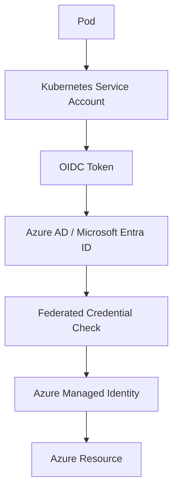

# AKS Workload Identity Explained

This document explains Azure Kubernetes Service (AKS) Workload Identity from beginner level to practical setup.

It covers:

- Why Workload Identity is needed
- Core components involved
- Step-by-step setup
- Runtime authentication flow
- Why both federated credential and service account annotation are required

---

## 1. The Problem Workload Identity Solves

Applications running inside AKS pods often need to access Azure services such as:

- Azure Key Vault
- Azure Storage
- Azure OpenAI
- Azure SQL
- Azure Service Bus

Azure requires authentication before allowing access.

However, pods do not have an Azure identity by default.

A common but insecure approach is to store credentials like:

```text
CLIENT_ID
CLIENT_SECRET
TENANT_ID
```

---

## Problems with this approach  
- Secrets can leak  
- Credentials must be rotated  
- Higher security risk  
- Increased operational overhead
    
Workload Identity solves this by allowing pods to authenticate to Azure without storing secrets.  

---

## 2. What is Workload Identity?

Workload Identity allows a Kubernetes Service Account to impersonate an Azure Managed Identity using OIDC federation.

```text
Kubernetes Service Account
            ↓
OIDC Federation
            ↓
Azure Managed Identity
            ↓
Azure Resource Access
```
This allows pods to securely access Azure services.

---

## 3. Components Involved

```text
| Component                  | Location    | Purpose                                                  |
| -------------------------- | ----------- | -------------------------------------------------------- |
| Kubernetes Service Account | AKS Cluster | Identity used by pods                                    |
| Managed Identity           | Azure       | Azure identity used to access resources                  |
| Federated Credential       | Azure       | Trust rule linking Kubernetes identity to Azure identity |
| Service Account Annotation | Kubernetes  | Tells pods which managed identity to use                 |
```

---

## 4. High-Level Architecture



---

## 5. Step-by-Step Setup
### Step 1 - Enable OIDC Issuer and Workload Identity on AKS

For a new AKS cluster:
```bash
az aks create \
  --resource-group my-rg \
  --name my-aks \
  --enable-oidc-issuer \
  --enable-workload-identity
```
For an existing AKS cluster:
```bash
az aks update \
  --resource-group my-rg \
  --name my-aks \
  --enable-oidc-issuer \
  --enable-workload-identity
```
### Step 2 - Get the AKS OIDC Issuer URL

```bash
az aks show \
  --name my-aks \
  --resource-group my-rg \
  --query "oidcIssuerProfile.issuerUrl" \
  --output tsv
```
Example output:
```text
https://oidc.prod-aks.azure.com/12345678-abcd-1234-abcd-123456789abc/
```
This issuer URL is used in the federated credential.

### Step 3 - Create an Azure Managed Identity

```bash
az identity create \
  --name payment-mi \
  --resource-group my-rg
```
Save:
Client ID
Resource ID
