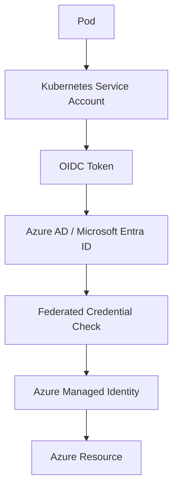
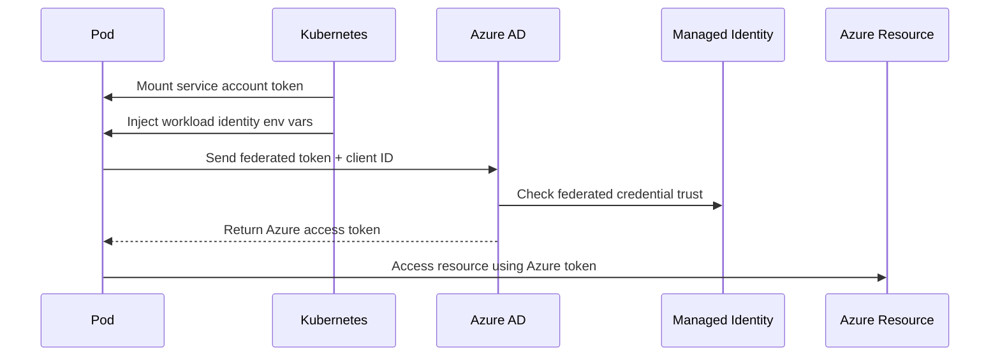

# AKS Workload Identity Explained

This document explains Azure Kubernetes Service (AKS) Workload Identity from beginner level to practical setup.

It covers:

- Why Workload Identity is needed
- Core components involved
- Step-by-step setup
- Runtime authentication flow
- Why both federated credential and service account annotation are required

---

## 1. The Problem Workload Identity Solves

Applications running inside AKS pods often need to access Azure services such as:

- Azure Key Vault
- Azure Storage
- Azure OpenAI
- Azure SQL
- Azure Service Bus

Azure requires authentication before allowing access.

However, pods do not have an Azure identity by default.

A common but insecure approach is to store credentials like:

```text
CLIENT_ID
CLIENT_SECRET
TENANT_ID
```

---

## Problems with this approach  
- Secrets can leak  
- Credentials must be rotated  
- Higher security risk  
- Increased operational overhead
    
Workload Identity solves this by allowing pods to authenticate to Azure without storing secrets.  

---

## 2. What is Workload Identity?

Workload Identity allows a Kubernetes Service Account to impersonate an Azure Managed Identity using OIDC federation.

```text
Kubernetes Service Account
            ↓
OIDC Federation
            ↓
Azure Managed Identity
            ↓
Azure Resource Access
```
This allows pods to securely access Azure services.

---

## 3. Components Involved

```text
| Component                  | Location    | Purpose                                                  |
| -------------------------- | ----------- | -------------------------------------------------------- |
| Kubernetes Service Account | AKS Cluster | Identity used by pods                                    |
| Managed Identity           | Azure       | Azure identity used to access resources                  |
| Federated Credential       | Azure       | Trust rule linking Kubernetes identity to Azure identity |
| Service Account Annotation | Kubernetes  | Tells pods which managed identity to use                 |
```

---

## 4. High-Level Architecture



---

## 5. Step-by-Step Setup
### Step 1 - Enable OIDC Issuer and Workload Identity on AKS

For a new AKS cluster:
```bash
az aks create \
  --resource-group my-rg \
  --name my-aks \
  --enable-oidc-issuer \
  --enable-workload-identity
```
For an existing AKS cluster:
```bash
az aks update \
  --resource-group my-rg \
  --name my-aks \
  --enable-oidc-issuer \
  --enable-workload-identity
```
### Step 2 - Get the AKS OIDC Issuer URL

```bash
az aks show \
  --name my-aks \
  --resource-group my-rg \
  --query "oidcIssuerProfile.issuerUrl" \
  --output tsv
```
Example output:
```text
https://oidc.prod-aks.azure.com/12345678-abcd-1234-abcd-123456789abc/
```
This issuer URL is used in the federated credential.

### Step 3 - Create an Azure Managed Identity

```bash
az identity create \
  --name payment-mi \
  --resource-group my-rg
```
Save:  
Client ID  
Resource ID  

### Step 4 - Assign Permissions to the Managed Identity
Example: allow it to read secrets from Key Vault.

```bash
az role assignment create \
  --assignee <managed-identity-client-id> \
  --role "Key Vault Secrets User" \
  --scope <keyvault-resource-id>
```
### Step 5 - Create a Kubernetes Service Account

```yaml
apiVersion: v1
kind: ServiceAccount
metadata:
  name: payment-sa
  namespace: backend
  annotations:
    azure.workload.identity/client-id: <managed-identity-client-id>
```
Why this annotation is needed  

This annotation tells the pod which Azure Managed Identity client ID it should use when requesting a token  

### Step 6 - Create the Federated Credential

```bash
az identity federated-credential create \
  --name payment-federation \
  --identity-name payment-mi \
  --resource-group my-rg \
  --issuer <AKS-OIDC-ISSUER> \
  --subject system:serviceaccount:backend:payment-sa \
  --audience api://AzureADTokenExchange
```
### What this does
- This creates the trust rule in Azure:
- Trust tokens from this AKS cluster issuer
- Trust this specific service account
- Allow it to act as this managed identity

---

## 6. Pod Configuration

Pods must use the correct service account.
```yaml
apiVersion: v1
kind: Pod
metadata:
  name: payment-api
  namespace: backend
spec:
  serviceAccountName: payment-sa
  containers:
    - name: payment
      image: myacr.azurecr.io/payment:v1
```
Now the pod uses the Kubernetes service account payment-sa.

## 7. Runtime Authentication Flow
### Step 1 - Pod Starts

The pod starts using:  
- Namespace: backend
- Service Account: payment-sa

### Step 2 - Kubernetes Issues a Service Account Token

Kubernetes generates a JWT token for the pod.

Typical claims include:
```text
iss = AKS OIDC issuer
sub = system:serviceaccount:backend:payment-sa
Step 3 - Workload Identity Injects Environment Variables
```
The pod gets environment variables like:
```text
AZURE_CLIENT_ID=<managed_identity_client_id>
AZURE_TENANT_ID=<tenant_id>
AZURE_FEDERATED_TOKEN_FILE=/var/run/secrets/...
```
The federated token file contains the Kubernetes service account token.

### Step 4 - Application Requests an Azure Token

Inside the application, the Azure SDK can use:

```python
from azure.identity import DefaultAzureCredential
credential = DefaultAzureCredential()
```

The SDK reads:
- AZURE_CLIENT_ID
- AZURE_TENANT_ID
- AZURE_FEDERATED_TOKEN_FILE 
and understands that it should use workload identity authentication.

### Step 5 - Pod Sends Token Request to Azure AD

The pod sends a token request to Azure AD with:

- Managed Identity client ID
- Kubernetes service account token

Important: the pod does not talk directly to the managed identity resource.  
It talks to Azure AD.  

### Step 6 - Azure AD Validates the Token

Azure AD checks:
- Does the token issuer match the AKS OIDC issuer?
- Does the token subject match the service account in the federated credential?
- Is the token signature valid?
If all checks pass, Azure AD trusts the pod.

### Step 7 - Azure AD Issues an Access Token

Azure AD returns a temporary Azure access token representing the managed identity.

### Step 8 - Pod Accesses Azure Resource

The pod uses that Azure token to access services like:

- Key Vault
- Storage
- Azure OpenAI

Example:
```text
Authorization: Bearer <access_token>
```

---

## 8. Runtime Flow Diagram


--- 


## 9. Why Both Annotation and Federated Credential Are Required

These two configurations solve different problems.

### Federated Credential

This is configured in Azure.
It tells Azure:
- Trust tokens from this Kubernetes service account.
So it is the trust relationship.

### Service Account Annotation

This is configured in Kubernetes.
It tells the pod:
- Use this managed identity client ID when requesting a token.
So it is the identity selection mechanism.

Summary
```text
| Configuration              | Purpose                               |
| -------------------------- | ------------------------------------- |
| Federated Credential       | Azure trusts Kubernetes identity      |
| Service Account Annotation | Pod knows which Azure identity to use |
```

Without annotation:
- Pod does not know which managed identity client ID to request
Without federated credential:
- Azure will not trust the Kubernetes service account token

---

## 10. Important Clarification

The AKS cluster identity is not the same as workload identity.

AKS has multiple identity layers:
```text
| Identity Type     | Used For                         |
| ----------------- | -------------------------------- |
| Cluster Identity  | AKS manages Azure infrastructure |
| Node Identity     | Nodes pull images from ACR       |
| Workload Identity | Pods access Azure services       |
```
Workload identity is specifically for pod-to-Azure-service authentication.

---

## 11. Security Benefits

Workload Identity provides:
- No stored secrets
- Automatic token rotation
- Better security than client secrets
- Pod-level access control
- Integration with Azure RBAC
- OIDC-based trust model

---

## 12. Recommended Production Pattern

Use different managed identities for different applications.

Example:
```text
| Application   | Managed Identity |
| ------------- | ---------------- |
| payment-api   | payment-mi       |
| order-api     | order-mi         |
| inventory-api | inventory-mi     |
```
This follows the principle of least privilege.

--- 

## 13. Summary

Workload Identity allows AKS pods to securely access Azure services without storing secrets.

### Final concept
```text
Pod
  ↓
Kubernetes Service Account
  ↓
OIDC token
  ↓
Azure AD validates trust using federated credential
  ↓
Azure AD issues token for Managed Identity
  ↓
Pod accesses Azure resource
```
