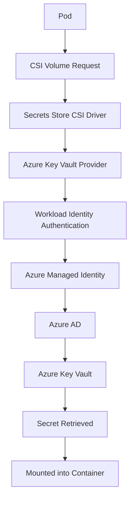

# AKS Secret Management with Azure Key Vault and CSI Driver

This document explains how secrets are securely managed in Azure Kubernetes Service (AKS).

It covers:

- Problems with traditional Kubernetes secrets
- Why secrets.yaml is insecure
- Using Azure Key Vault as a centralized secret store
- Why the Secrets Store CSI Driver exists
- How AKS retrieves secrets from Key Vault
- Secret rotation behavior
- Architecture of secret delivery in AKS

---

## 1. The Problem with Traditional Kubernetes Secrets

In Kubernetes, secrets are traditionally created using a YAML file.

Example:

```yaml
apiVersion: v1
kind: Secret
metadata:
  name: db-secret
type: Opaque
data:
  DB_PASSWORD: cGFzc3dvcmQ=
```
The secret is then injected into the pod using environment variables.
```text
env:
- name: DB_PASSWORD
  valueFrom:
    secretKeyRef:
      name: db-secret
      key: DB_PASSWORD
```
Architecture:
```text
secrets.yaml
      ↓
Kubernetes Secret
      ↓
Pod
      ↓
Application reads secret
```
---

## 2. Why Kubernetes Secrets Are Not Ideal

Kubernetes secrets have several security limitations.  
Secrets Are Stored in etcd  
  
Kubernetes stores secrets inside its database:  
etcd  
If etcd is compromised, attackers can retrieve all stored secrets.  

Secrets Often End Up in Git Repositories  
Developers sometimes commit:  
secrets.yaml  
into Git repositories.  
Even if later removed, Git history still contains the secret.

Secret Rotation Is Difficult
If a password changes in the database:

Database password updated
You must:
```text
Update secrets.yaml
Apply changes
Restart pods
```
This process is manual and error-prone.

## 3. Using Azure Key Vault as a Central Secret Store

Azure Key Vault provides a secure system for storing secrets such as:
- Database passwords
- API keys
- Certificates
- Connection strings

Key Vault offers:
- centralized secret storage
- secure access control
- audit logging
- secret rotation capabilities

Architecture:
```text
Application
     ↓
Azure Key Vault
```
However, Kubernetes cannot directly retrieve secrets from Key Vault by itself.

---

## 4. Why the Secrets Store CSI Driver Exists
The Secrets Store CSI Driver solves the problem of delivering secrets from external systems into Kubernetes pods.  
CSI stands for:  
### Container Storage Interface  
It is a Kubernetes plugin framework used to mount external resources as volumes inside containers.  

Originally designed for storage systems, CSI can also mount secrets from providers like:  
- Azure Key Vault
- AWS Secrets Manager
- HashiCorp Vault
- Google Secret Manager

---

## 5. What the CSI Driver Does  
The Secrets Store CSI Driver retrieves secrets from external secret stores and mounts them as files inside containers.  
Example file path inside container:  
```text
/mnt/secrets-store/db-password
```
The application reads the secret directly from the file.

Example:
```python
password = open("/mnt/secrets-store/db-password").read()
```
The application does not need to include Key Vault SDK code.

---

## 6. Architecture of AKS Secret Management

In production environments, AKS typically uses:
```text
Workload Identity
+
Secrets Store CSI Driver
+
Azure Key Vault
```
Architecture:


---

## 7. SecretProviderClass Resource

Instead of storing secrets in Kubernetes, CSI uses a custom resource called:
### SecretProviderClass

Example configuration:
```yaml
apiVersion: secrets-store.csi.x-k8s.io/v1
kind: SecretProviderClass
metadata:
  name: azure-keyvault-secrets
spec:
  provider: azure
  parameters:
    keyvaultName: my-keyvault
    tenantId: <tenant-id>
    objects: |
      array:
        - |
          objectName: db-password
          objectType: secret
```
Important:  
- The YAML only contains the secret name
- The actual secret value remains in Azure Key Vault

---

## 8. Pod Configuration Using CSI Driver

Pods mount the CSI volume to retrieve secrets.

Example:
```yaml
apiVersion: v1
kind: Pod
metadata:
  name: payment-api
  namespace: backend
spec:
  serviceAccountName: payment-sa

  containers:
    - name: payment
      image: myacr.azurecr.io/payment:v1
      volumeMounts:
        - name: secrets-store
          mountPath: "/mnt/secrets-store"
          readOnly: true

  volumes:
    - name: secrets-store
      csi:
        driver: secrets-store.csi.k8s.io
        readOnly: true
        volumeAttributes:
          secretProviderClass: "azure-keyvault-secrets"
```
Now the container can access secrets from:
```text
/mnt/secrets-store/
```
---

## 9. Runtime Secret Retrieval Flow

When the pod starts, the following occurs:
- Pod requests a CSI volume.
- Kubernetes sends the request to the CSI driver.
- The CSI driver contacts the Azure Key Vault provider.
- Authentication happens using Workload Identity.
- Azure AD validates the identity and issues an access token.
- The Key Vault provider retrieves the secret.
- The secret is mounted into the container as a file.

Flow:
```text
Pod starts
     ↓
CSI driver triggered
     ↓
Authenticate using Workload Identity
     ↓
Access Key Vault
     ↓
Retrieve secret
     ↓
Mount secret in container
```

---

## 10. Secret Rotation Behavior

If a secret is updated in Key Vault:
Key Vault secret updated
The CSI driver can automatically refresh the mounted secret file.

Flow:
```text
Key Vault secret updated
        ↓
CSI driver detects change
        ↓
Mounted secret updated
        ↓
Application reads new value

This removes the need to redeploy pods when secrets change.
```
---

## 11. Security Advantages of CSI Driver

Using the CSI driver improves security in several ways.

Feature	Benefit
```text
| Feature                    | Benefit   |
| -------------------------- | --------- |
| Secrets stored in Git      | ❌ Avoided |
| Secrets stored in etcd     | ❌ Avoided |
| Centralized secret storage | ✔ Yes     |
| Dynamic secret retrieval   | ✔ Yes     |
| Secret rotation support    | ✔ Yes     |
| No secret values in YAML   | ✔ Yes     |
```
---

## 12. Comparison of Secret Retrieval Methods
```text
| Method            | Description                                  |
| ----------------- | -------------------------------------------- |
| Kubernetes Secret | Secret stored in etcd                        |
| Application SDK   | Application directly calls Key Vault         |
| CSI Driver        | Kubernetes retrieves secrets and mounts them |
```
Most platform teams prefer the CSI driver approach because it separates secret management from application logic.

---

## 13. Full Secret Lifecycle in AKS
```text
Secret stored in Azure Key Vault
        ↓
Pod requests CSI volume
        ↓
CSI driver authenticates using Workload Identity
        ↓
Secret retrieved from Key Vault
        ↓
Mounted inside container
        ↓
Application reads secret
```
---

## 14. Summary

Secure secret management in AKS typically uses:
```text
Azure Key Vault
+
Workload Identity
+
Secrets Store CSI Driver
```
Roles of each component:
```text
| Component         | Responsibility      |
| ----------------- | ------------------- |
| Azure Key Vault   | Secret storage      |
| Workload Identity | Authentication      |
| CSI Driver        | Secret delivery     |
| Application       | Consumes the secret |
```

This architecture ensures secrets remain secure while still being accessible to applications running in Kubernetes.
